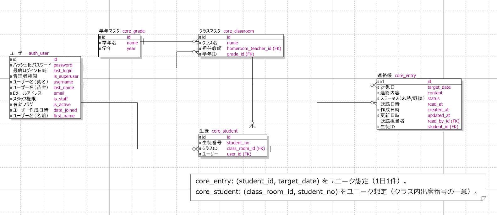

# 🏫 学校連絡帳管理システム 利用マニュアル（簡易版）

## 1. システム概要
本システムは、生徒が日々の学習・体調・生活記録を提出し、担任が確認・既読処理を行うための  
**学校連絡帳管理システム（PoC：概念実証）**です。  
従来の紙の連絡帳運用をWeb化し、提出漏れ防止と情報共有の効率化を目的としています。

---

## 2. 利用者と機能一覧

| 役割 | 主な機能 | 備考 |
|------|-----------|------|
| 生徒 | ・連絡帳の新規提出 ・連絡帳の更新 ・過去記録の閲覧 | 過去記録は編集不可 |
| 担任 | ・提出内容の閲覧・既読処理 ・当日提出状況の確認 | 編集不可 |
| 管理者 | ・ユーザー作成（生徒・担任） ・クラス・学年の登録 | Django管理画面 `/admin/` より操作 |

---

## 3. ログイン・基本操作

### 3.1 ログイン
1. ブラウザでデプロイ先URLにアクセス  
2. ログイン画面にて、配布されたID・パスワードを入力  
3. 成功すると利用者別のメニュー画面が表示されます  

> 対象ブラウザ：Microsoft Edge（学校配布PC共通）

---

### 3.2 生徒の操作手順
1. ログイン後、連絡帳提出画面に移動します。
2. 前登校日の内容を入力（入力日の前日が土日祝の場合はその前の平日が提出対象となります）    
   - 前登校日の振り返りをテキスト欄にて自由記述です。 
3. 「提出」ボタンで提出完了  ※先生の既読処理が行われるまでは同画面で「更新して提出」ボタンを押すことで編集・再提出が可能です。
4. 「ホームへ戻る」リンクから過去記録を閲覧が可能です。（編集不可）  

> 記入例：   
> - 「連絡帳の内容を入力」テキスト欄：数学の小テストを復習しました。部活では基礎練習を行いました。

---

### 3.3 担任の操作手順
1. ログイン後「先生アカウント」画面へ移動します。  
2. 担当クラス生徒の連絡一覧が表示されます。  
3. 提出済み生徒の連絡帳は「本日分の提出」項目に表示されます。  
4. 問題なければ「👍 いいね」ボタンを押してください。  
5. 押下後は「👍 いいね済み」になり、既読処理が完了します。
6. 既読処理完了後、画面下部の「履歴（最新200件）」欄に「👍 いいね済み」の履歴と既読処理をした日時が表示されます。

---

### 3.4 管理者の操作手順
1. 管理画面 `/admin/` にアクセスすると**サイト管理**画面に遷移します。  

2. **学年・クラス** の作成  
   - 学年を追加する場合：**Core → Grades** 右部にある「+追加」ボタンから登録  
   - クラスを追加する場合：**Core → Class rooms** 右部にある「+追加」ボタンから登録  

3. **生徒・担任アカウント** の作成
   1. 管理画面メニューの「認証と認可 → ユーザー」を開きます。  
   2. 右上の「追加」ボタンを押し、ユーザー登録画面を開きます。  
   3. 以下の項目を入力・設定してください。
      - **ユーザー名**：任意の英数字（例：`teacher1`、`student01`）  
      - **パスワード**：任意（再入力欄も入力）
      - **有効**：✅ チェックを入れる  
      - **スタッフ権限／スーパーユーザー権限**：☑ チェック不要  
   4. 画面下部の「グループ」欄で該当権限を付与します。  
      - 生徒の場合：**STUDENT**  
      - 先生の場合：**TEACHER**  
      → 右矢印（>）で「選択されたグループ」に移動  
   5. ページ最下部の **「保存」ボタン** を押して登録完了です。  

> ※ 詳細な画面操作は下図を参照してください。  
> 

---

## 4. テストアカウント一覧（例）

> ※別紙 `/doc/ユーザー一覧.txt` に別途記載。

---

## 5. ER図・補足

- 設計時に作成したER図：  

- 本システムでは、既読処理が行われた時点でデータを「過去記録」として扱います。  
- 学年・クラス構成は PoC のため最小構成（1年1・2・3組、2年1・2・3組、3年1・2・3組、各30名）で実装しています。  
- 長期休暇は仕様上考慮しておりません。（追加機能として実装を検討中）

---

## 6. 注意事項
- 提出データは編集不可となります。
- 本システムはPoC（概念実証）のため、モバイル環境での最適化は行っていません。  
- 本番環境URLおよび動作確認IDは評価用に提供します。  

