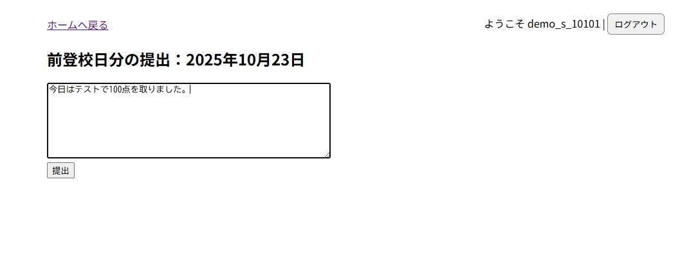
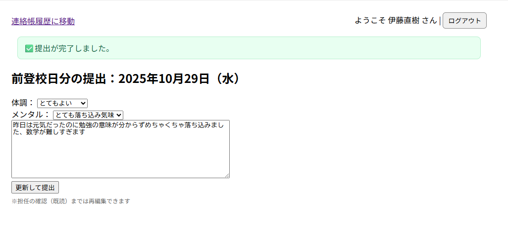
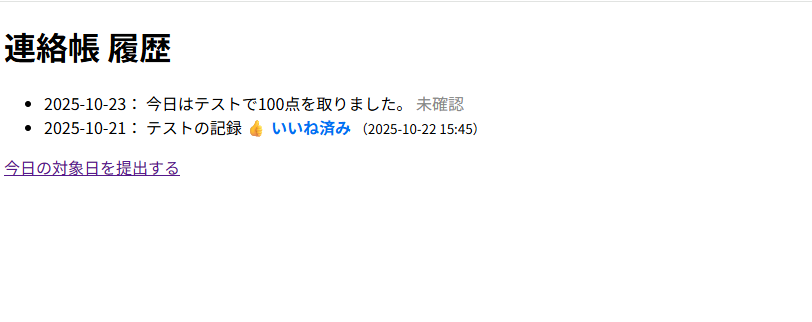
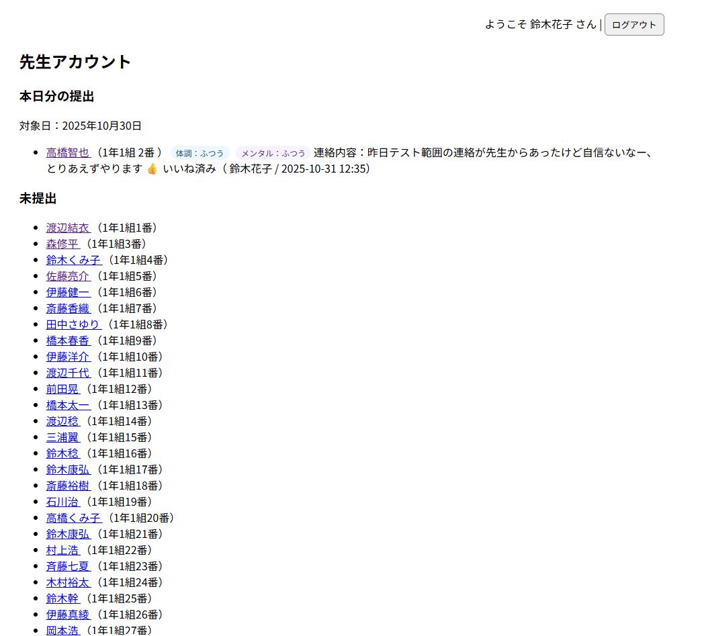
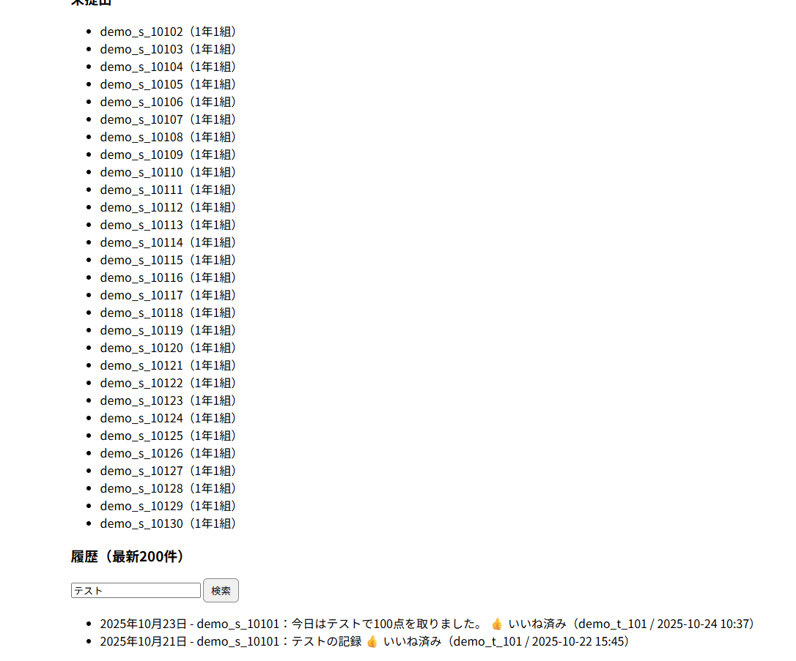
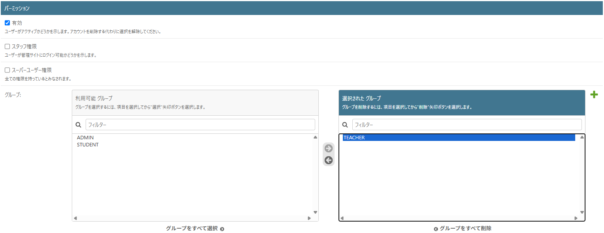
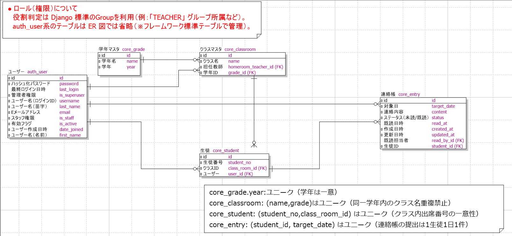

# 🏫 学校連絡帳管理システム 利用マニュアル（簡易版）

## 1. システム概要
本システムは、生徒が日々の学習・体調・生活記録を提出し、担任が確認・既読処理を行うための  
**学校連絡帳管理システム（PoC：概念実証）**です。  
従来の紙の連絡帳運用をWeb化し、提出漏れ防止と情報共有の効率化を目的としています。

---

## 2. デプロイ先URL

https://jpt-intern-fyf0b3ebavbufger.japanwest-01.azurewebsites.net

備考：Microsoft Edge推奨。（Google Chromeを使用した際はセキュリティ警告ページに遷移しますので、警告を無視することで動作が可能です。）

---

## 3. 利用者と機能一覧

| 役割 | 主な機能 | 備考 |
|------|-----------|------|
| 生徒 | ・連絡帳の新規提出 ・連絡帳の更新 ・過去記録の閲覧 | 先生既読処理後、過去記録は編集不可 |
| 担任 | ・提出内容の閲覧・既読処理 ・当日提出状況の確認 | 編集不可 |
| 管理者 | ・ユーザー作成（生徒・担任） ・クラス・学年の登録 | Django管理画面 `/admin/` より操作 |

---

## 4. ログインユーザーとパスワード（動作確認に使用ください）

| 役割 | ログインID | パスワード |
|------|-----------|------|
| 生徒 | demo_s_<生徒ナンバー> ※<生徒ナンバー>は学年番号、クラス番号、生徒番号の数字の組み合わせです。 例：1年1組5番の場合は`demo_s_10105`、3年2組26番の場合は`demo_s_30226`|`pass1234`（一律）|
| 担任 | demo_t_<先生ナンバー> ※<先生ナンバー>は学年番号、クラス番号の数字の組み合わせです。 例：1年3組の場合は`demo_t_103`、2年2組の場合は`demo_t_202`|`pass1234`（一律）|
| 管理者 |`admin`|`Pass_0123`|

※備考：デモデータを投入済み。クラスは1年1組～3年3組の計9クラス、生徒番号は各クラスとも1～30番までとなります。
またテストアカウントは評価用のものであり、実運用時はセキュリティ面を考慮して変更必須となります。

---

## 5. ログイン・基本操作

### 5.1 ログイン
1. ブラウザでデプロイ先URLにアクセス  
2. ログイン画面にて、項目4.に記載されたID・パスワードを入力  
3. 成功すると利用者別のメニュー画面が表示されます  

> 対象ブラウザ：Microsoft Edge（学校配布PC共通）

---

### 5.2 生徒の操作手順
1. ログイン後、「前登校日分の提出」画面に移動します。
2. 前登校日の内容を入力（入力日の前日が土日の場合はその前の平日が提出対象となります。追加実装として同様に前日が祝日の場合もその前の平日が提出対象となるように実装しています。）    
   - 前登校日の振り返りをテキスト欄にて自由記述です。 
3. 「提出」ボタンで提出完了となり、登録完了のメッセージが表示されます。 なお、先生の既読処理が行われるまでは同画面で「更新して提出」ボタンを押すことで編集・再提出が可能です。
4. 「ホームへ戻る」リンクから過去記録を閲覧が可能です。（内容は編集不可）  

> 記入例：   
> - 「連絡帳の内容を入力」テキスト欄：数学の小テストを復習しました。部活では基礎練習を行いました。

※ 画面詳細は下図を参照してください。
> 
> 
> 

---

### 5.3 担任の操作手順
1. ログイン後「先生アカウント」画面へ移動します。  
2. 担当クラス生徒の連絡一覧が表示されます。  
3. 提出済み生徒の連絡帳は「本日分の提出」項目に、未提出の生徒は「未提出」の項目にそれぞれ表示されます。  
4. 確認・既読処理については「👍 いいね」ボタンを押してください。なお、先生アカウントでは生徒の連絡帳の内容を編集することはできません。  
5. 押下後は「👍 いいね済み」になり、既読処理が完了します。
6. 既読処理完了後、画面下部の「履歴（最新200件）」欄に「👍 いいね済み」の履歴と既読処理をした日時が表示されます。一度既読処理を完了すると既読処理の取り消しをすることが出来ません。なお、履歴のテキストボックスから生徒IDやキーワードなどで検索をすることも可能です。

※ 画面詳細は下図を参照してください。
> 
> 
> 

---

### 5.4 管理者の操作手順
1. 管理者画面`/admin/`にアクセスすると**サイト管理**画面に遷移します。  

2. **クラス** の作成   
   - クラスを追加する場合：**Core → Class rooms** 右部にある「+追加」ボタンから登録
   - ※学年（year）は初期設定時に一度だけ登録します（データ投入時に登録済の状態）。
     運用中の追加・変更は想定していませんので登録手順は割愛いたします。
     なお、`year` フィールドには SQL の UNIQUE 制約を設定しており、同一学年の重複登録を防止します。
     （例：「1年（`year=1`）」を2回登録しようとするとエラーが発生します）

3. **生徒・担任アカウント** の作成
   1. 管理画面メニューの「認証と認可 → ユーザー」を開きます。  
   2. 右上の「追加」ボタンを押し、ユーザー登録画面を開きます。  
   3. 以下の項目を入力・設定してください。
      - **ユーザー名**：任意の英数字（例：`teacher1`、`student01`）  
      - **パスワード**：任意（再入力欄も入力、UIの入力チェックの指定に沿って入力してください）
      - **有効**：✅ チェックを入れる  
      - **スタッフ権限／スーパーユーザー権限**：☑ チェック不要  
   4. 画面下部の「グループ」欄で該当権限を付与します。  
      - 生徒の場合：**STUDENT**  
      - 先生の場合：**TEACHER**
      - 管理者の場合：**ADMIN**  
      → 右矢印（>）で「選択されたグループ」に移動
      ※ 複数の権限も付与することが可能です。

   5. ページ最下部の **「保存」ボタン** を押して登録完了です。  

※ 詳細な画面操作は下図を参照してください。  
> 

### 5.5 ログアウト
1. 各画面上部に「ログアウト」ボタン/リンクを設けております。  
2. 「ログアウト」を押下することでログアウト処理が行われログイン画面に遷移します。

---

## 6. 設計資料（ER図・テスト・補足）

### 6.1 ER図
- 設計時に作成したER図：  

### 6.2 補足
- 本システムでは、既読処理が行われた時点でデータを「過去記録」として扱います。  
- 学年・クラス構成は PoC のため最小構成（投入デモデータ分）で実装しています。  
- 長期休暇は仕様上考慮しておりません。（追加機能として実装を検討）

### 6.3 動作テスト実施について
開発環境にて全テストを通過済です（`python manage.py test` 実行にて確認済み）。
本番環境では動作確認のみを実施予定です。
※ テスト内容：日付ロジック（前登校日算出）および既読編集バリデーションの2項目。

---

## 7. 注意事項
- 提出データは編集不可となります。（既読→未読処理を追加機能として実装予定）
- 本システムはPoC（概念実証）のため、モバイル環境での最適化は行っていません。  
- 本番環境URLおよび動作確認IDは評価用に提供します。  
- データベースは SQLite を使用しています（PoCレベルの軽量DB）。
- 想定データ件数：生徒270名＋教員9名（投入デモデータ分）。
- 同時アクセスを伴う大規模運用は対象外です。