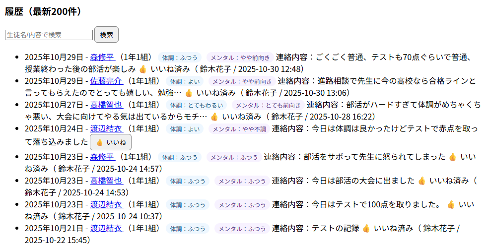
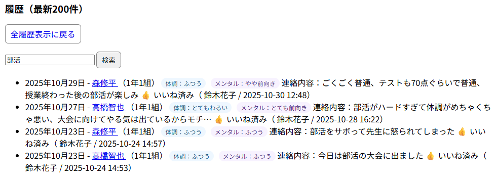
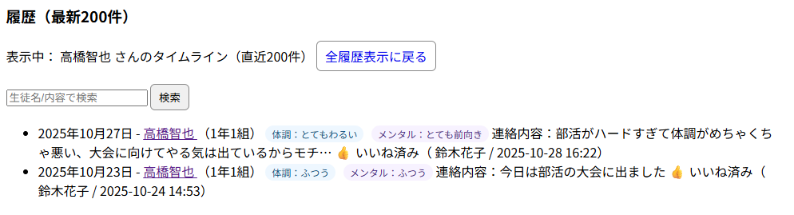
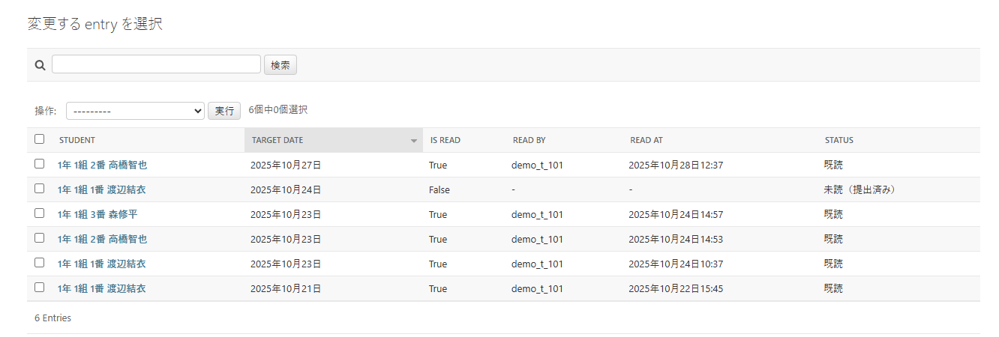
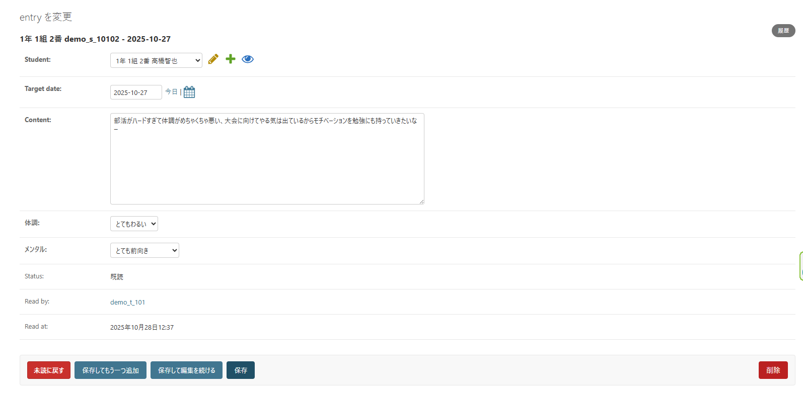
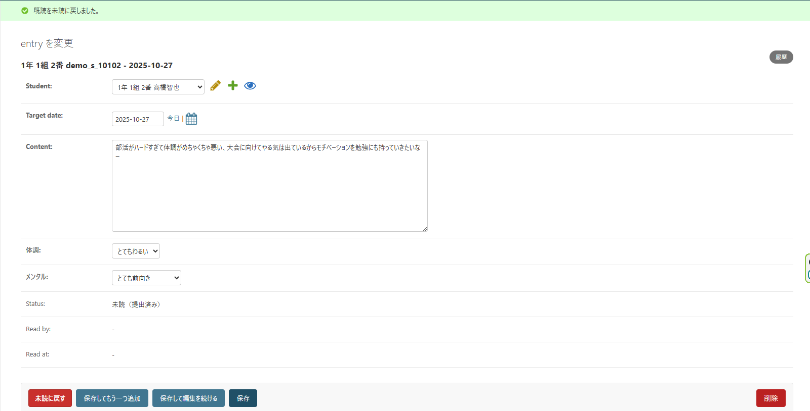

**作成日**：2025年10月24日  
**最終更新日**：2025年10月25日  
**作成者**：Isaku Uezato
---

# 🏫 学校連絡帳管理システム 利用マニュアル（簡易版）

## 1. システム概要
本システムは、生徒が日々の学習・体調・生活記録を提出し、担任が確認・既読処理を行うための  
**学校連絡帳管理システム（PoC：概念実証）** です。  
従来の紙の連絡帳運用をWeb化し、提出漏れ防止と情報共有の効率化を目的としています。

---

## 2. デプロイ先URL

https://jpt-intern-fyf0b3ebavbufger.japanwest-01.azurewebsites.net

備考：Microsoft Edge推奨。（Google Chromeを使用した際はセキュリティ警告ページに遷移しますので、警告を無視することで動作が可能です。）

---

## 3. 利用者と機能一覧

| 役割 | 主な機能 | 備考 |
|------|-----------|------|
| 生徒 | ・連絡帳の新規提出<br>・連絡帳の更新<br>・過去記録の閲覧 | 先生既読処理後、過去記録は編集不可 |
| 担任 | ・提出内容の閲覧・既読処理<br>・当日提出状況の確認 | 編集不可 |
| 管理者 | ・ユーザー作成（生徒・担任）<br>・クラスの登録 | Django管理画面 `/admin/` より操作 |

---

## 4. ログインユーザーとパスワード（動作確認に使用ください）

| 役割 | ログインID | パスワード |
|------|-----------|------|
| 生徒 | demo_s_<生徒ナンバー><br>※<生徒ナンバー>は学年番号、クラス番号、生徒番号の数字の組み合わせです。<br>例：1年1組5番の場合は`demo_s_10105`、3年2組26番の場合は`demo_s_30226`|`pass1234`（一律）|
| 担任 | demo_t_<先生ナンバー><br>※<先生ナンバー>は学年番号、クラス番号の数字の組み合わせです。<br>例：1年3組の場合は`demo_t_103`、2年2組の場合は`demo_t_202`|`pass1234`（一律）|
| 管理者 |`admin`|`Pass_0123`|

※備考：デモデータを投入済み。クラスは1年1組～3年3組の計9クラス、生徒番号は各クラスとも1～30番までとなります。
またテストアカウントは評価用のものであり、実運用時はセキュリティ面を考慮して変更必須となります。

---

## 5. ログイン・基本操作

### 5.1 ログイン
1. ブラウザでデプロイ先URLにアクセス  
2. ログイン画面にて、項目4.に記載されたID・パスワードを入力  
3. 成功すると利用者別のメニュー画面が表示されます  

> 対象ブラウザ：Microsoft Edge（学校配布PC共通）

---

### 5.2 生徒の操作手順
1. ログイン後、「前登校日分の提出」画面に移動します。
2. 前登校日の内容を入力（入力日の前日が土日の場合はその前の平日が提出対象となります。追加実装として同様に前日が祝日の場合もその前の平日が提出対象となるように実装しています。）    
   - 「体調」はプルダウンメニューで「とてもわるい」～「とてもよい」の5段階から選択可能となっています。
   - 「メンタル」も同様にプルダウンメニューで「とても落ち込み気味」～「とても前向き」の5段階から選択可能となっています。
   - 前登校日の振り返り内容はテキスト欄にて自由記述です。 
3. 「提出」ボタンで提出完了となり、提出完了のメッセージが表示されます。 なお、先生の既読処理が行われるまでは同画面で「更新して提出」ボタンを押すことで編集・再提出が可能です。
4. 「連絡帳履歴に移動」リンクから過去記録を閲覧が可能です。（内容は編集不可）  

> 記入例：
> -  体調：ふつう　メンタル：よい
> - 「連絡帳の内容を入力」テキスト欄：数学の小テストを復習しました。部活では基礎練習を行いました。

※ 画面詳細は下図を参照してください。
> 
> 
> 

---

### 5.3 担任の操作手順
1. ログイン後「先生アカウント」画面へ移動します。  
2. 担当クラス生徒の連絡一覧が表示されます。  
3. 提出済み生徒の連絡帳は「本日分の提出」項目に、未提出の生徒は「未提出」の項目にそれぞれ表示されます。  
4. 確認・既読処理については「👍 いいね」ボタンを押してください。なお、先生アカウントでは生徒の連絡帳の内容を編集することはできません。  
5. 押下後は「👍 いいね済み」になり、既読処理が完了します。
6. 既読処理完了後、画面下部の「履歴（最新200件）」欄に「👍 いいね済み」の履歴と既読処理をした担当教師/日時が表示されます。  
一度既読処理を完了すると先生アカウントでは既読処理の取り消しをすることが出来ません。なお、履歴のテキストボックスから生徒IDやキーワードなどで検索をすることも可能です。  
また、当日既読処理を行うことが出来なかった場合も履歴から「👍 いいね」ボタンを押下することで既読処理にすることが可能です。
7. 追加機能として生徒名にリンクを設けており、リンク押下をすると履歴からその生徒の履歴を抽出することも可能です。  
元に戻す場合は「全履歴表示に戻る」ボタンで全履歴表示に戻すことが可能です。

※ 画面詳細は下図を参照してください。
> 
> 
> 
> 
> 

---

### 5.4 管理者の操作手順
1. 管理者画面`/admin/`にアクセスすると**サイト管理**画面に遷移します。  

2. **クラス** の作成  
（※ 本PoCでは仕様を満たすクラスを既に作成済みのため対応範囲外の実装、現時点で不要の操作となります。）  

   - クラス（例：1年4組）を追加する場合：**CORE → Class rooms** 右部にある「+追加」ボタンから登録  
   「Grade」からプルダウンで学年を選択、「Name」に学級名（例：`4組`）を入力。  
   「Homeroom teacher」を`TEACHER`権限を持つユーザーの中からプルダウンで選択（ユーザーIDを手入力で絞り込みが可能）し、  
   「保存」ボタン押下で作成が可能となります。  
   なお、`TEACHER`権限を持たないユーザーの指定も可能ですが不具合が生じる可能性があります。（動作保証外）  
   また、SQLのUNIQUE制約により同一学年かつ同一クラスの登録は出来ません。

   - ※学年（year）は初期設定時に一度だけ登録します（データ投入時に登録済の状態）。  
     運用中の追加・変更は想定していませんので登録手順は割愛いたします。  
     なお、`year` フィールドにはSQLのUNIQUE 制約を設定しており、同一学年の重複登録を防止します。  
     （例：「1年（`year=1`）」を2回登録しようとするとエラーが発生します）

3. **生徒・担任アカウント** の作成  
（※ 本PoCでは仕様を満たすユーザーデータを既に作成済みのため対応範囲外の実装、現時点で不要の操作となります。） 

   1. 管理画面メニューの「認証と認可 → ユーザー」を開きます。  
   2. 右上の「追加」ボタンを押し、ユーザー登録画面を開きます。  
   3. 以下の項目を入力・設定してください。
      - **ユーザー名**：任意の英数字（例：`teacher1`、`student01`）  
      - **パスワード**：任意（再入力欄も入力、UIの入力チェックの指定に沿って入力してください）
      - **有効**：✅ チェックを入れる  
      - **スタッフ権限／スーパーユーザー権限**：☑ チェック不要  
   4. 画面下部の「グループ」欄で該当権限を付与します。  
      - 生徒の場合：**STUDENT**  
      - 先生の場合：**TEACHER**
      - 管理者の場合：**ADMIN**  
      → 右矢印（>）で「選択されたグループ」に移動
      ※ 複数の権限も付与することも操作上可能ですが、本PoC段階では1権限1画面を前提としておりますので不具合が生じる可能性があります。

   5. ページ最下部の **「保存」ボタン** を押して登録完了です。  

※ 詳細な画面操作は下図を参照してください。  
> 

5. **既読処理の取り消し機能** （追加実装）
   1. 管理画面メニューの「CORE → Entries」を開きます。  
   2. 「変更する entry を選択」画面で`STATUS`が「既読」となっている任意の連絡帳を`STUDENT`のリンクから選択して押下します  
   3. 「entry を変更」画面にて、最下部にある「未読に戻す」ボタンを押下してください。 
   4. 画面上部にメッセージが表示され`Status`が「未読（提出済み）」に戻り、既読状態が取り消しとなります。  
   既読処理取り消し後は、再度生徒用連絡帳画面で内容の編集や先生アカウント画面にて既読処理を再度行うことが可能です。

   ※ 詳細な画面操作は下図を参照してください。  
   > 
   > 
   > 

### 5.5 ログアウト
1. 各画面上部に「ログアウト」ボタン/リンクを設けております。  
2. 「ログアウト」を押下することでログアウト処理が行われログイン画面に遷移します。

---

## 6. 設計資料（ER図・テスト・補足）

### 6.1 ER図
- 設計時に作成したER図：  


### 6.2 補足
- 本システムでは、既読処理が行われた時点でデータを「過去記録」として扱います。  
- 学年・クラス構成は PoC のため最小構成（投入デモデータ分）で実装しています。  
- 長期休暇は仕様上考慮しておりません。

### 6.3 動作テスト実施について
開発環境にて全テストを通過済です（`python manage.py test` 実行にて確認済み）。  
本番環境では動作確認のみを実施予定です。  
※ テスト内容：日付ロジック（前登校日算出）および既読編集バリデーションの2項目。

---

## 7. 注意事項
- 本システムはPoC（概念実証）のため、モバイル環境での最適化は行っていません。  
- データベースは SQLite を使用しています（PoCレベルの軽量DB）。
- 想定データ件数：生徒270名＋教員9名（投入デモデータ分）。
- 同時アクセスを伴う大規模運用は対象外です。

## 8. デプロイ手順
今回の本番環境へのデプロイではAzure CLIを使ったzipデプロイを採用しています。  
以下にデプロイ手順の概要を記載します。  
※環境変数などの詳細な設定は複雑であるため、本項では概要のみを記載します。

#### 1. 事前準備
1. **Azure CLI** をローカル環境にインストールします。  
   （参考）Microsoft公式ドキュメント：https://learn.microsoft.com/cli/azure/install-azure-cli
2. Azure CLI にログインします。
   ```bash
   az login
   ```  
#### 2. デプロイ用ファイルの作成
GitのHEADブランチからアーカイブを作成します。

```bash
git archive --format=zip -o app.zip HEAD
```  
上記コマンドにより、デプロイ用ファイル app.zip が生成されます。

#### 3. zipデプロイの実行
Azure CLIで以下のコマンドを実行し、本番環境にデプロイします。

```bash
az webapp deploy \
  -g jpt-intern_group \
  -n jpt-intern \
  --src-path app.zip \
  --type zip
```  
- `-g` : リソースグループ名  
- `-n` : Webアプリ名（Azure上のApp Service名）  
- `--src-path` : デプロイ対象のzipファイルパス  
- `--type zip` : zipデプロイを指定  

#### 4. データベースのセットアップ
データベースには SQLite を使用しています。  
アプリケーションのデプロイ後、自動的に `db.sqlite3` が作成・初期化される構成です。  
永続化のため、DB ファイルは `/home/data/db.sqlite3` に配置しています。

1. SSH または Kudu コンソールからサーバーへ接続します。
2. 以下のコマンドを実行し、マイグレーション（DjangoによるDB構築処理）を適用します。
   ```bash
   python manage.py migrate
   ```  

3. 初期データ（学年・クラス・ユーザー）を投入します。  
データ投入処理は `seed_bulk.py` に定義されており、下記コマンドにより自動生成されます。
   ```bash
   python manage.py seed_bulk --grades 3 --classes 3 --students 30 --prefix demo
   ```  

4. 必要に応じて、スーパーユーザー（管理者）を作成します。
   ```bash
   python manage.py createsuperuser
   ```  

#### 5. デプロイ後の確認
- Web アプリの URL にアクセスし、ログイン画面が正常に表示されることを確認します。
- 管理画面 （`/admin/`） にアクセスし、ユーザー・クラスデータが反映されていることを確認します。
- 生徒・担任・管理者の各ロールでログインテストを行い、主要機能が動作することを確認します。

#### 備考
- 本手順は **Azure App Service（Japan West リージョン）** にて検証済みです。
- デプロイの都度、`migrate` と `collectstatic` の実行が必要となる場合があります。
- Azure Oryx により自動ビルドが行われるため、Python 環境を手動構築する必要はありません。